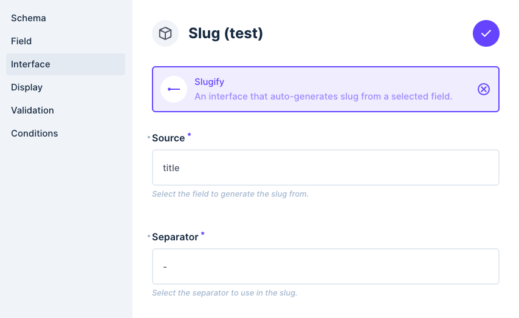
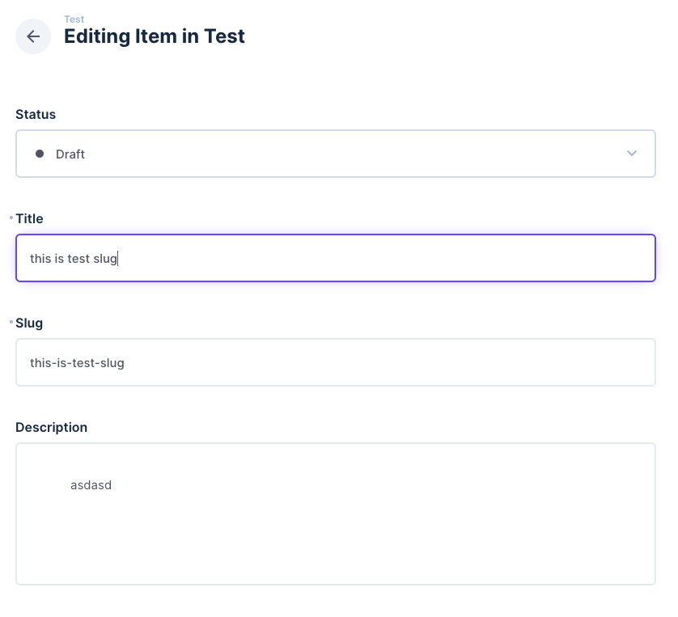

# Directus Slugify Extension

This is a custom extension for Directus that provides slugification functionality. It automatically generates URL-friendly slugs from specified fields.

## Table of Contents

- [Features](#features)
- [Installation](#installation)
- [Configuration](#configuration)
- [Usage](#usage)
- [Disclaimer](#disclaimer)
- [Contributing](#contributing)
- [License](#license)


## Features

- Automatically generate slugs from specified fields
- Customizable slug generation rules
- Seamless integration with Directus

## Installation

1. Clone the repository into your Directus extensions folder.

2. Restart your Directus server to load the new extension:
   ```sh
   npx directus start
   ```
   If you are using docker restart container.

## Configuration

- `source`: The field from which the slug will be generated.

- `separator`: The character used to separate words in the slug.

## Usage



This plugin is designed for string fields and has a simple usage. All you have to do is select the source and separator. Slug field will watch source field value.



## Disclaimer

I developed this extension for personal usage and it may not cover all use cases. Please note that I am not an expert in Vue or Directus. Use this extension at your own risk and feel free to contribute to its improvement.

## Contributing

Contributions are welcome! Please open an issue or submit a pull request on GitHub.

You can modify and use the source code as you wish.

Build extension:

```sh
bun run build
```

Development:

```sh
bun run watch
```
> While developing, you may need to restart the container for the changes to take effect.

```sh
docker compose down && docker compose up -d 
```

## License

This project is licensed under the MIT License. See the [LICENSE](LICENSE.txt) file for details.
